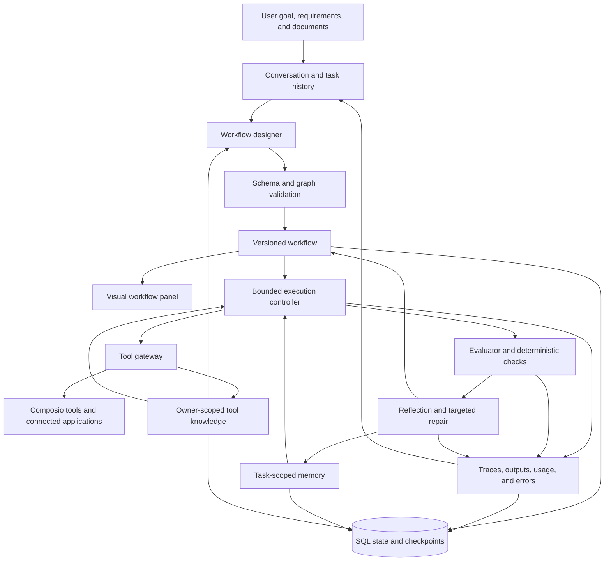
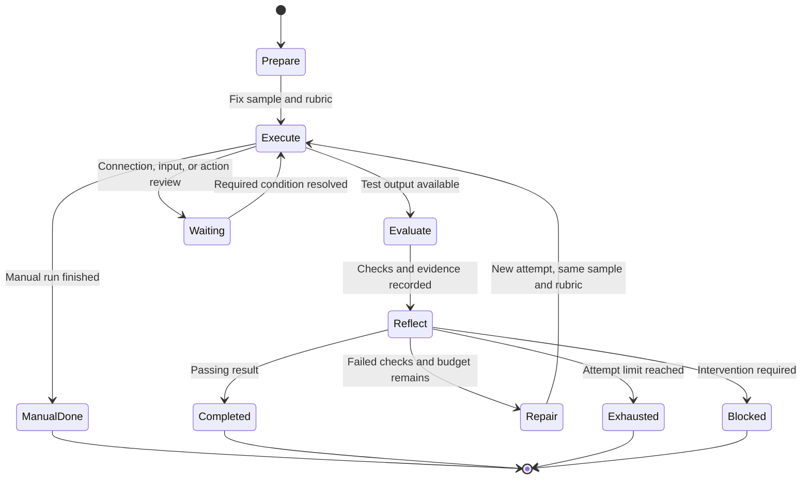
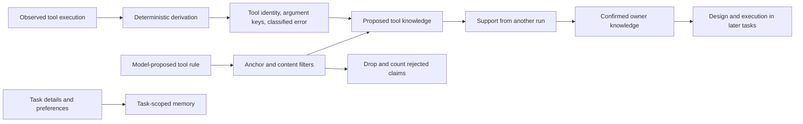
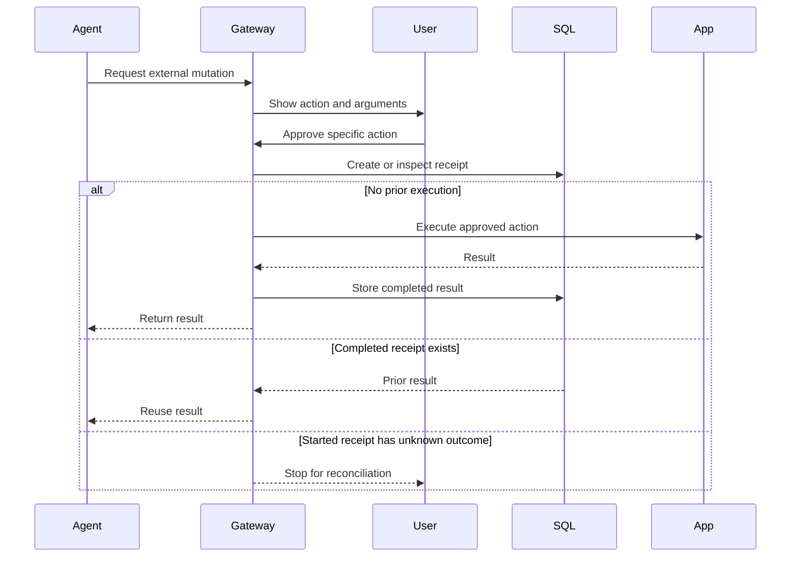
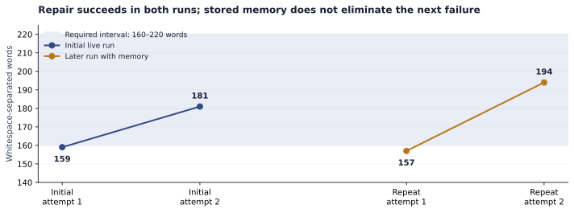
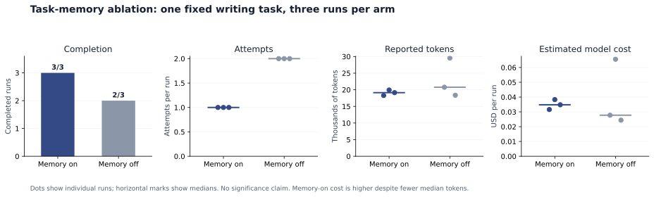
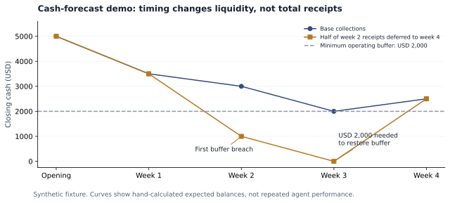

# Agent Foundry

## Evidence-Guided Design, Recovery, and Memory for Tool-Using Agents

**Automated Agent Engineering · September 2026**

This report describes the implemented system and experiments preserved in this repository. It is a project technical report, not a peer-reviewed publication.

### Abstract

Agent Foundry investigates a practical question: can a system turn a user’s goal into a specialized agent workflow, observe its failures, and improve subsequent behavior without changing model weights? The implementation combines a conversational interface, model-generated workflow graphs, a bounded execution and repair controller, evidence-linked evaluation, and two distinct memory stores. Task-specific lessons remain within their originating conversation; a separate owner-scoped store records reusable knowledge about tools. External applications are accessed through Composio, with discovered schemas, connection checks, restricted capabilities, and review before mutations.

The central design decision is to treat improvement as a claim that requires measurement. The system preserves test inputs and rubrics across repair attempts, records model and tool traces, and supports matched task-memory ablations. In one fixed writing task with three runs per arm, memory-on completed three of three runs in one attempt, while memory-off completed two of three and used two attempts in every run. Median reported tokens were 7.9% lower with memory, but median estimated model cost was 25.3% higher. These observations are directional and do not establish generalization or a cost advantage. Three synthetic finance workflows demonstrate document ingestion and multi-step reasoning. A separate fixture review rejected an invoice output that had received a perfect workflow-rubric score, exposing a gap in the evaluator rather than in the execution loop alone.

The contribution is an inspectable engineering system: architecture generation, controlled recovery, memory curation, and measurement operate in one workspace. The evidence supports working repair loops and a small task-memory effect. Cross-task tool-learning gains, sustained reliability, and enterprise-scale operation remain questions for further evaluation.

**Keywords:** agent engineering; tool use; self-reflection; contextual memory; workflow synthesis; LLM evaluation; fault recovery; ablation studies.

---
## 1. Problem and research questions

A useful agent must do more than produce a plausible plan. It must select tools that actually exist, supply valid arguments, interpret returned data, recognize an incomplete result, and recover without repeating unsafe actions. When the same mistake recurs, the system should retain something more useful than an increasingly long transcript.

Agent Foundry accepts a goal, available application capabilities, and success requirements. It generates a bounded workflow, runs a sample, evaluates the result, and revises the workflow when the evidence warrants another attempt. Users inspect that process in chat and subsequently run the resulting architecture on their own inputs.

Three processes must be distinguished. **Within-run repair** changes a workflow after a failed attempt. **Task-memory reuse** carries relevant lessons into later runs of the same conversation. **Cross-task tool knowledge** makes observations about tools available to other tasks belonging to the same owner. A successful repair does not prove useful memory, and a larger memory store does not prove transfer.

| Research question | Implemented mechanism | Evidence available today |
|---|---|---|
| RQ1. Can an observed failure produce a useful repair? | Frozen sample and rubric; trace-based reflection; versioned graph repair | Live writing repair and finance test histories |
| RQ2. Does task memory improve later execution? | Frozen-snapshot memory-on/off runs | One fixed writing task; three runs per arm |
| RQ3. Can tool experience transfer without sharing task memory? | Separate owner-scoped knowledge store; gated promotion and retrieval | Structural implementation and regression tests; no live transfer benchmark |
| RQ4. Can recovery avoid predictable waste and unsafe replay? | Schema reuse, bounded read retries, stagnation detection, mutation receipts | Deterministic fault injection and regression checks |
| RQ5. Does evaluation recognize correct outputs? | Deterministic assertions, model judgment, evidence gates, separate fixture review | A documented false positive and subsequent correction |

The contribution is the integration of these mechanisms into a reviewable system. It does not claim a new foundation model, reinforcement-learning algorithm, or the first reflective agent. Its distinguishing feature is that workflow changes, evaluation decisions, memory updates, and measured outcomes can be examined together—including cases where the numbers do not improve.

## 2. Research foundations and design boundaries

The implementation draws on several related lines of work. The table separates the principle adopted from mechanisms outside this system’s scope.

| Work | Relevant principle | Application in Agent Foundry | Boundary |
|---|---|---|---|
| [Reflexion, Shinn et al., 2023](https://arxiv.org/abs/2303.11366) | Linguistic feedback can become episodic memory without weight updates | Evidence-linked failure and strategy records retrieved in later execution | No reproduction of the paper’s benchmark results |
| [Self-Refine, Madaan et al., 2023](https://arxiv.org/abs/2303.17651) | Generation, feedback, and refinement form an iterative loop | Separate execution, evaluation, reflection, and repair phases | The same configured model serves several roles; errors can correlate |
| [Automated Design of Agentic Systems, Hu et al., 2024](https://arxiv.org/abs/2408.08435) | Agent architectures themselves can be search objects | Model-generated and revised workflow representation | Search over a restricted graph DSL, not arbitrary agent programs |
| [Agentic Context Engineering, Zhang et al., 2025](https://arxiv.org/abs/2510.04618) | Context can evolve through structured, incremental updates | Bounded records, deduplication, evidence references, selective retrieval | Not a full ACE implementation or evaluation |
| [GEPA, Agrawal et al., 2025](https://arxiv.org/abs/2507.19457) | Execution traces can guide reflective prompt changes | Failed checks inform targeted instruction or graph repair | No population search, Pareto-frontier selection, or GEPA optimizer |
| [τ-bench, Yao et al., 2024](https://arxiv.org/abs/2406.12045) | Evaluate task outcomes and repeated tool-agent consistency | Motivates evidence gates and the planned external-state benchmark | Current demos do not implement τ-bench |
| [LLM-as-a-Judge, Zheng et al., 2023](https://arxiv.org/abs/2306.05685) | Model judges have systematic biases and reasoning limitations | Deterministic overrides, separate fixture expectations, score caveats | A judge call is not ground truth |

These sources informed engineering choices. Their published performance numbers are not evidence for this repository. Recovery-specific decisions are described in [the applied research note](docs/RECOVERY_RESEARCH.md).

## 3. System architecture

### 3.1 Task representation

Conceptually, a task is a tuple:

$$
\mathcal{T} = (g, A, x, R, B, M_t, K_o)
$$

Here, $g$ is the goal, $A$ is the available application capability set, $x$ is the run input, $R$ is the evaluation rubric, and $B$ is the execution budget. $M_t$ denotes memory belonging to task $t$, while $K_o$ denotes tool knowledge belonging to owner $o$. The designer produces a workflow $W=(V,E)$ whose nodes carry roles, instructions, assigned toolkits, and dependencies.

This abstracts the implemented types; it does not imply that all quantities are optimized jointly. The current controller seeks a satisfactory rubric result within limits. It does not perform global optimization over quality, cost, and latency.

### 3.2 Components and data flow



*Figure 1. Logical architecture. SQL stores state across requests; the browser presents and advances the selected task. Arrows show dependencies and information flow, not concurrent worker processes.*

| Layer | Implementation | Purpose |
|---|---|---|
| Workspace | React 19, TypeScript, Vinext | Persistent conversations, input review, tests, settings |
| Workflow visualization | React Flow | Inspect agents, dependencies, tools, versions, manual execution |
| Model gateway | Gemini JSON generation; default `gemini-3.8-flash` | Design, execution reasoning, evaluation, reflection, repair |
| Controller | LangGraph with application-managed state | Advance bounded phases through explicit transitions |
| Tools | Composio REST integration and local policy checks | Discover schemas, connect accounts, constrain execution |
| State | SQL through the D1 interface | Chats, runs, leases, receipts, metrics, knowledge, schema cache |
| Observability | Local traces; optional LangSmith forwarding | Inspect outputs, errors, usage, timing, recovery evidence |
| Node adapter | Worker bridge with SQLite-backed D1 compatibility | Reuse the application bundle in a Node/Cloud Run environment |

### 3.3 Why a constrained workflow language?

The model emits structured data rather than executable source code. Validation requires one to eight agents, unique node IDs, valid references, no dependency cycle, and exactly one terminal delivery node joining all branches. A workflow contains two to six weighted criteria; each node can name at most five toolkits.

This makes architectures inspectable and invalid structures rejectable before execution. It also limits discovery: arbitrary programs, unbounded recursive agents, and invented execution primitives are outside the search space. Branches are represented visually, but the executor currently advances nodes serially. A wide graph is not evidence of parallel speedup.

| Decision | Reason | Tradeoff |
|---|---|---|
| Typed graph instead of executable generated code | Validate structure and bound capabilities | Less architectural freedom |
| One final delivery node | Give evaluation a clear final artifact | Independent deliverables need explicit assembly |
| Retained workflow versions and repairs | Attribute changes to attempts | More state to inspect |
| Separate task and tool memory | Preserve conversational scope while permitting transfer | Distinct promotion and retrieval rules |
| Sample testing plus manual execution | Test before applying personal input | Samples may be unrepresentative |
| SQL checkpoints between steps | Resume and reject conflicting writes | No background scheduler implied |

Up to 20 workflow versions are retained. Chat history is bounded while preserving the initial request and recent user instructions. These are practical context limits, not a lossless archive policy.

## 4. Execution and recovery

### 4.1 Inner graph, outer learning loop

Each attempt executes an acyclic workflow. A separate outer controller is cyclic: it evaluates, reflects, repairs, and executes another attempt. Structural validation therefore coexists with iterative improvement.



*Figure 2. Simplified states. Runtime errors and budget guards can also terminate a run. Waiting for an external condition is different from discovering a better prompt.*

```text
Validate and select a workflow version.
Choose a supplied test input, or generate one sample once.
Freeze the sample and rubric for this run.

For each allowed attempt:
    Retrieve eligible memory and tool knowledge.
    Execute dependency-ready nodes within model and tool limits.
    Record outputs, errors, tool observations, and usage.
    Evaluate the final artifact against the frozen rubric.
    Reflect on failures and curate evidence-linked lessons.
    If the result passes, finish.
    If execution is blocked, stop for the required intervention.
    If the attempt limit is reached, preserve the failed result.
    Otherwise, repair the workflow and begin another attempt.
```

The sample is not regenerated after each failure: otherwise, improvement could come from an easier input. The rubric is also preserved during repair so the agent cannot succeed merely by weakening its own test. A user-requested redesign can establish new criteria for a subsequent run; it does not rewrite an old evaluation.

### 4.2 Bounded operation

| Control | Current setting | Interpretation |
|---|---|---|
| Workflow size | 1–8 agents | Structural bound, not a recommended swarm size |
| Selected applications | Up to 8 per task | Limits application scope |
| Acceptance threshold | Default 0.85; configurable 0.5–1.0 | Task-rubric threshold, not calibrated accuracy |
| Attempts | Default 3; configurable 1–8 | Stops repeated repair |
| Tool-call budget | Default 16; configurable 1–60 | Includes counted retry activity |
| Reasoning turns | Up to 7 per node | Stops indefinite tool negotiation |
| Reported token guard | 250,000 per run | Checked before another advance; one call can overshoot |
| Model request timeout | 55 seconds | Bounds an individual request |
| Model output allowance | 7,000 tokens; one 14,000-token truncation recovery | Both calls contribute reported usage |
| Task memory | At most 60 records; retrieve up to 8 | Bounds context growth |

These controls make failure finite. They do not guarantee that partial external operations can be undone or that financial cost has a strict pre-execution ceiling.

### 4.3 Classify failures before acting

Blindly retrying every error is dangerous when tools can send messages or create records. Recovery distinguishes transient reads from authorization problems, invalid arguments, and mutations.

| Failure class | Response | Reason |
|---|---|---|
| Transient read/discovery failure | At most two retries with exponential delay and jitter | Provider availability may recover |
| Missing or expired connection | Stop and surface a connection prompt | Model reasoning cannot authorize an account |
| Invalid arguments | Validate against discovered schema; expose the failure | The argument contract must change |
| Identical failed read repeated | Suppress using a canonical argument fingerprint | Avoid paying repeatedly for the same failure |
| Repeated schema failures | Stop at the local failure bound | Endless guessing is not useful recovery |
| Failed quality check | Reflect and revise within the attempt limit | The artifact or strategy needs improvement |
| Uncertain mutation outcome | Fail closed and require reconciliation | A timeout does not prove the provider did nothing |

Read retries cover selected transient HTTP responses and timeouts. Delay is `250 × 2^retry + jitter` milliseconds, with 0–99 ms jitter. A new retry is not started after the retry window; this is not a strict deadline for the enclosing operation. Mutations are never automatically transport-retried.

Six deterministic recovery checks can be posted to chat. They use fault injection and make no external application calls. They verify recovery policy, not real task success. See [recovery policy](lib/workbench/recovery.ts), [fault checks](lib/workbench/recovery-checks.ts), and [recorded evidence](docs/DOCUMENT_RECOVERY_EVIDENCE.json).

## 5. Learning without weight updates

### 5.1 Two stores with different responsibilities

A task needs private context, such as a preferred reporting format. A different task may benefit from knowing that a tool requires a particular argument. Sharing the entire first task’s memory to obtain the second benefit would violate conversational isolation. Agent Foundry implements separate stores instead.

| Property | Task memory | Tool knowledge |
|---|---|---|
| Scope | One chat/task | One authenticated owner across tasks |
| Content | Context, preferences, strategies, failures, local tool lessons | Tool identities, argument-key observations, classified failures, gated usage rules |
| Persistence | `chat.memory` | Separate `tool_knowledge` SQL store |
| Retrieval | Lexical relevance; up to eight records | Toolkit-matched confirmed records; bounded prompt inclusion |
| Confidence | Proposed, supported, contradicted, user-confirmed | Proposed, confirmed, retired |
| Evidence | Source run and traces | Tool observations and supporting runs |
| Live ablation treatment | Retrieval enabled or disabled | Held constant; not the ablated variable |

Task retrieval scores lexical overlap with current conversational context, boosting supported or user-confirmed records when overlap exists. It is not embedding retrieval or a learned retriever. Contradicted records are excluded. Reflection proposes at most five bounded records, deduplicated by normalized content. Later-run evidence can support or contradict a lesson; a run cannot demonstrate successful transfer simply by proposing its own lesson.

Generated samples require another distinction: invented test details should not become facts about the user. For generated-input runs, proposals are restricted to strategy, failure, and tool-rule categories rather than general context or preferences.

### 5.2 Deriving reusable tool knowledge



*Figure 3. Separate paths for task context and reusable tool observations. Confirmation means repeated support, not universal validity.*

The first promotion path is deterministic. It retains tool/toolkit identifiers, argument **keys**, schema requirements, and classified error tokens. It excludes values and raw provider error text, since errors can echo document contents or user input.

The second path admits model-authored tool rules after filtering. A rule must be short, anchored to a discovered tool or toolkit, and free of obvious content-bearing patterns such as URLs, email addresses, long identifiers, and long quoted spans. Claims sharing a six-word phrase with task content are dropped rather than rewritten into supposedly safe language. Drops are counted.

This is useful minimization, but the model-authored path is heuristic. A paraphrase or short sensitive fact may evade lexical filters. Structural store separation is enforceable; an absolute guarantee that no task information enters a generated rule is not established. Support from a different run also need not come from a different task, so confirmation counts cannot stand in for measured transfer.

Tool knowledge is advisory. It cannot grant access, override schemas, or bypass action review. See [tool knowledge](lib/workbench/tool-knowledge.ts) and [memory validation and curation](lib/workbench/validation.ts).

### 5.3 Schema reuse is a separate efficiency mechanism

Experience and caching solve different problems. A learned rule may change behavior; a cache avoids rediscovering an unchanged contract.

Discovered schemas carry across repair attempts when the corresponding node is unchanged. A separate owner-scoped SQL cache has a 24-hour TTL, keyed by the normalized query and toolkit set. Connection status is excluded from the cached contract. On a hit, the gateway recomputes account liveness and falls back to discovery if uncertain, including when public account-free tools are absent from connected-account listings.

An unchanged node used in three attempts can therefore require one discovery round trip instead of three. That is a mechanism and regression-tested case, **not a measured general reduction in live tool costs**. The published memory experiment made no tool calls. Persistent schema caching is disabled in paired experiments to avoid one arm warming the other’s cache.

## 6. Third-party tools and external effects

### 6.1 Discovery and connections

Composio provides discovery and account authorization; the application retains responsibility for its own restrictions and run semantics. This follows the distinction between schemas and user-scoped connections in [Composio’s architecture documentation](https://docs.composio.dev/docs/how-composio-works).

The picker contains a bundled snapshot of **1,505 toolkits**, retrieved through two metadata pages on September 6, 2026. Featured, finance, and all-app views make the catalog navigable. The count describes discovered entries; it does not mean 1,505 integrations have been connected or tested.

An unlinked workflow application produces a connection card in the same conversation. Automatic advancement waits for verified status. OAuth consent remains with the owner, and the callback preserves the task identifier. Selecting an application does not silently connect an account.

| Search capability | Connection model | Verified scope |
|---|---|---|
| Web Search | Reviewed public aliases using Exa, Tavily, or DuckDuckGo tools | One live public-research run |
| Google Search through SerpApi | Requires the owner’s SerpApi connection | Discovery recorded; connected execution unverified |

Public search mappings permit only reviewed search/read operations, not unrestricted Composio meta-operations. See [catalog and search evidence](docs/SEARCH_CATALOG_EVIDENCE.json).

### 6.2 Reviewed mutations and durable receipts



*Figure 4. Simplified mutation protocol. Receipt identity includes owner, chat, run, tool, and arguments; replay protection applies within that scope.*

A completed receipt can be reused during recovery. A started receipt with an unknown outcome requires reconciliation. This is not an exactly-once transaction spanning SQL and an external provider: a crash can occur after the provider acts but before the result is persisted. A new run creates a new intent and can repeat an action. Rolling back a local checkpoint cannot undo an external write.

The finance demos therefore generate and review draft artifacts from synthetic files. They do not post invoices, send messages, or initiate payments.

## 7. Evaluation specification

### 7.1 Scores, evidence gates, and acceptance

Each run has a frozen rubric with positive weights. Criteria are model-judged or deterministic. Let $s_i$ be the normalized criterion score in $[0,1]$, $w_i>0$ its weight, and $G$ indicate that all nodes finished and every app-dependent node has at least one successful tool trace:

$$
S = \begin{cases}
\frac{\sum_i w_i s_i}{\sum_i w_i}, & G=1, \\
0, & G=0.
\end{cases}
$$

For threshold $\tau$, acceptance requires:

$$
\mathrm{pass}=G\land(S\geq\tau)\land\bigwedge_{i\in\mathrm{required}}(s_i\geq\tau).
$$

A high optional score cannot compensate for a required criterion below threshold. Missing evidence contributes zero. Incomplete execution caused by missing connection, input, or budget is blocked; other unsuccessful attempts can proceed to revision within limits.

| Check | Evaluation | What it does not establish |
|---|---|---|
| Word count | Normalize limited Markdown; count whitespace-separated words, including headings | Semantic quality or a language-independent word definition |
| Required terms | Case-insensitive literal substring presence | Correct numeric meaning, factual support, completeness |
| Forbidden terms | Case-insensitive literal substring absence | Absence of paraphrased prohibited meaning |
| Model rubric | Separate call; numeric score, rationale, valid trace references | Ground truth or calibrated probability |
| Final-output evidence | Final node done with a successful model trace | Correctness of every sentence |
| Tool evidence gate | At least one successful tool trace per app-dependent node | Every necessary action occurred or final external state is correct |

For model checks, missing/non-finite scores, empty rationales, and nonexistent or errored trace references cannot support a verified score. Valid scores are clamped to the unit interval. Deterministic assertions override the model on those criteria and require completed final-output evidence.

The judge is a separate call to the same configured Gemini model. This separates execution from assessment operationally, not statistically. Shared biases can affect both. The exact normalization is in [validation.ts](lib/workbench/validation.ts).

### 7.2 What the metrics mean

| Metric | Definition | Interpretation |
|---|---|---|
| Rubric score | Weighted, evidence-gated score | Satisfaction of the frozen checks |
| Test completion rate | Completed evaluated runs / eligible runs, including failures | Reliability under the tested conditions |
| Attempts | Number of executed attempts | Repair effort, not proof of learning |
| Reported tokens | Provider-reported input and output usage | Usage visible to the system |
| Estimated model cost | Reported usage × configured prices | Estimate, not a provider invoice |
| Recorded duration | Sum of trace durations across attempts | Instrumented active time, not user-perceived wall time |
| Tool errors / wasted calls | Failed tool traces plus schema-rejected model requests | Defined failure proxy, not all unnecessary work |
| Discovery reuse | Search traces marked cached or reused | Cache behavior, distinct from reasoning quality |

Manual completion is excluded from evaluated pass rates. It means the workflow produced an output, not that a judge approved it. Missing scores and unknown costs remain `null`; charts should not turn them into zero.

**Accuracy needs independently defined correct outcomes.** A task score is not a calibrated accuracy percentage. An accuracy study requires independent expectations, held-out inputs, a specified scoring unit, and enough repetitions to characterize uncertainty.

### 7.3 The evaluator can fail

The invoice demo initially reached a workflow score of 1.00. A separate review against hand-calculated expectations still found missing aggregate eligible totals and a missing held amount. Literal assertions and an incomplete rubric had accepted an artifact that did not satisfy the full reporting contract.

Correction changed the reporting requirements and criteria through a new design step. It did not relabel the earlier artifact. Both the passing workflow score and failed fixture review remain visible. A self-healing loop is useful only if inadequate tests can also be identified.

## 8. Experiments and results

### 8.1 Live writing repair and recurrence

The initial writing example required an Atlas Notes product-launch text of 160–220 words. Attempt one contained 159 words and scored 0.60. Repair emphasized aiming inside the interval; attempt two contained 181 words and scored 1.00.

A later run with stored memory still produced 157 words initially, scoring 0.60 before repair reached 194 words and 1.00. This demonstrates recovery, but the sequential comparison changes context and workflow history together. It is not a clean estimate of memory’s effect.



*Figure 5. Recorded final-output word counts. Both runs repair a violation; stored memory does not eliminate recurrence. The shaded interval is the deterministic acceptance range.*

| Run | Attempt 1 | Attempt 2 | Input / output tokens | Estimated cost |
|---|---|---|---:|---:|
| Initial live run | 159 words; 0.60 | 181 words; 1.00 | 15,142 / 10,083 | Unknown |
| Later run with memory | 157 words; 0.60 | 194 words; 1.00 | 24,597 / 8,481 | $0.0502515 |

The initial run’s missing price stays unknown. Memory growth and eventual repair do not establish lower cost or better first-attempt performance. Sources: [initial evidence](docs/LIVE_RUN_EVIDENCE.json), [repeat evidence](docs/REPEAT_RUN_EVIDENCE.json).

### 8.2 Matched task-memory ablation

The ablation uses a stricter writing task: an Atlas Notes brief of 195–205 words covering offline editing, Markdown export, and shared notebooks, excluding “revolutionary” and “seamless.” One warm-up run populates memory; six records are frozen for three memory-on and three memory-off runs.

Every arm starts from the same workflow version and fixed input. Arms alternate on/off and run sequentially. A failed arm may repair its architecture: “frozen graph” means the **starting** graph, not a ban on repair. Each arm allows two attempts. The experiment is tool-free.

The current in-app experiment additionally snapshots owner tool knowledge, holds it constant, suppresses knowledge writes, and disables the shared persistent schema cache. Its start guard requires retrievable task memory and hashes content rather than IDs alone. These controls make the intervention explicit: task memory changes while shared learning state stays fixed. They do not turn the recorded tool-free experiment into a transfer study.



*Figure 6. Three runs per arm on one input. Dots are individual measurements; horizontal marks are medians. Memory-on used fewer attempts but had higher median estimated model cost. No significance claim is made.*

| Outcome | Memory on | Memory off | Interpretation |
|---|---:|---:|---|
| Completed tests | 3 / 3 | 2 / 3 | Directional difference |
| Median attempts | 1 | 2 | Every control run used a repair |
| Median tokens | 19,132 | 20,774 | 7.9% fewer with memory |
| Median estimated cost | $0.034794 | $0.0277575 | 25.3% higher with memory |
| Median recorded duration | 20.832 s | 20.937 s | About 0.5% lower; not enough for a speed claim |
| Tool calls | 0 | 0 | No tool-learning or cache measurement |

| Pair | Arm | Status | Attempts | Score | Tokens | Estimated cost | Recorded duration |
|---|---|---|---:|---:|---:|---:|---:|
| 1 | On | Completed | 1 | 1.00 | 18,284 | $0.031596 | 19.339 s |
| 1 | Off | Completed | 2 | 1.00 | 20,774 | $0.027758 | 20.937 s |
| 2 | On | Completed | 1 | 1.00 | 19,931 | $0.038315 | 25.581 s |
| 2 | Off | Completed | 2 | 1.00 | 29,535 | $0.065573 | 46.466 s |
| 3 | On | Completed | 1 | 1.00 | 19,132 | $0.034794 | 20.832 s |
| 3 | Off | Exhausted | 2 | 0.60 | 18,368 | $0.024408 | 20.247 s |

The application’s `memory_helped` label follows a directional rule: compare completion rate first, median attempts second, and median tool errors third. Fewer than three eligible results per arm produces `insufficient_data`. Three is a display safeguard, not a confidence threshold. The verdict does not optimize cost and does not mean memory improves every metric.

An earlier harness snapshot was taken immediately after design, before execution populated memory. It reported `memory_hurt`, but the arms effectively had the same memory condition. It measured model variance instead of the intended treatment. The evidence file retains a **narrative account** of that invalid measurement and the resulting warm-up and guards; it does not contain the invalid run’s full raw records.

There is one task, one input, deterministic arm ordering, no fixed sampling seed, and three observations per condition. Design and warm-up costs are outside the per-arm table. This is an integration and measurement case study, not a population estimate. Full rows: [ablation evidence](docs/ABLATION_EVIDENCE.json).

### 8.3 Finance workflows and an evaluator failure

Three account-free cases exercise different reasoning patterns with synthetic Excel inputs. They expose contextual mistakes without requiring Zoho Books or another accounting account.

| Workflow | Input complications | Expected outcome | Input |
|---|---|---|---|
| Orders to invoice drafts | Duplicate line, discounts, tax, mixed currencies, missing billing details | Three drafts, separate currency totals, held order | [Excel](public/demos/invoice-drafts.xlsx) |
| Reconcile deposits, fees, and timing | Many-to-one settlement, fee, duplicate ledger entry, uncleared check, unexplained debit | Complete bridge to USD 795 bank movement | [Excel](public/demos/bank-reconciliation.xlsx) |
| Cash runway under delayed collections | Weekly receipts/payments, operating buffer, delayed rather than lost receipts | Base/downside balances and timing of funding need | [Excel](public/demos/cash-forecast.xlsx) |

The invoice fixture expects eligible totals of **USD 1,398 and EUR 600**, kept separate, and a held **USD 750** order. Customer-level USD drafts are USD 1,188 and USD 210. Deduplicating the repeated line is part of the task, not permission to discard legitimate rows.

The reconciliation includes a USD 970 settlement: USD 1,000 gross receipts less a USD 30 fee. After removing a duplicate ledger entry, the bridge is:

$$
780 + 120 - 30 - 75 = 795\;\text{USD}.
$$

USD 120 is an uncleared-check timing adjustment; USD 75 remains an unexplained debit requiring review. Producing the final number without these explanations would miss important context.

The cash case begins with USD 5,000 and a USD 2,000 buffer. Deferring half of week 2’s receipts to week 4 preserves total receipts but shifts liquidity pressure earlier.



*Figure 7. Hand-calculated expected balances, not repeated agent-performance observations. The downside first breaches the buffer in week 2 and needs USD 2,000 in week 3 to restore it.*

| Observation | Attempts | Workflow score | Separate fixture review | Tokens | Estimated run cost | Recorded duration |
|---|---:|---:|---|---:|---:|---:|
| Invoice before correction | 2 | 1.00 | **Failed:** aggregate totals and held amount missing | 45,639 | $0.062387 | 41.162 s |
| Bank reconciliation | 1 | 1.00 | Passed | 18,750 | $0.027800 | 16.184 s |
| Cash forecast | 1 | 1.00 | Passed | 24,353 | $0.036370 | 19.409 s |
| Invoice after correction | 1 | 1.00 | Passed | 30,188 | $0.040263 | 21.338 s |

The separate reviewer compared outputs with hand-calculated expectations, but used the same configured Gemini model. “Separate” means another call with a different evaluation input, not an independent model family or blinded human assessor. Review costs are recorded separately from the run costs above.

| Separate review | Input tokens | Output tokens | Estimated review cost |
|---|---:|---:|---:|
| Invoice before correction | 1,229 | 479 | $0.002718 |
| Bank reconciliation | 1,875 | 16 | $0.00146625 |
| Cash forecast | 1,630 | 16 | $0.0012825 |
| Invoice after correction | 1,625 | 16 | $0.00127875 |

The first invoice run’s two attempts came from the automatic repair loop. The subsequent reporting correction came through the demo harness’s follow-up design instruction after the separate review. It supplied general reporting requirements rather than hardcoded amounts. This distinction prevents attributing the entire correction to an autonomous evaluator-repair integration that the evidence does not demonstrate.

All three final test outputs passed the separate review. They remain fixed cases within **one finance domain**, not three independently sampled domains or a production accuracy estimate. Manual executions are retained separately and excluded from test pass rates. See [finance evidence](docs/FINANCE_DEMO_EVIDENCE.json), [fixtures](lib/workbench/finance-demos.json), and [recording instructions](docs/LOCAL_DEMOS.md).

### 8.4 Other verification evidence

| Evidence class | Recorded result | Boundary |
|---|---|---|
| Public web research | One completed real Composio workflow; score 1.00 | Integration example, not search-quality benchmark |
| Recovery fault injection | Six deterministic checks; no external calls | Policy behavior under injected failures |
| Document handling | PDF/DOCX/text browser checks; XLSX extraction regressions | Not OCR or arbitrary document fidelity |
| Current regression suite | **68 passed, 0 failed** during report verification | Software invariants, not 68 real-world tasks |
| Reference harness at `/lab` | Deterministic analytics, customer-operations, scheduling fixtures | Separate synthetic system, not live LLM generalization |

Historical files retain counts and checks from their own collection dates. The current 68-test result does not rewrite those snapshots. No new provider-backed performance experiment was run merely to produce this report.

## 9. Cost, speed, and observability

Model cost is estimated as:

$$
\widehat{C}=\frac{T_{\mathrm{in}}p_{\mathrm{in}}+T_{\mathrm{out}}p_{\mathrm{out}}}{10^6}.
$$

The default Gemini 3.8 Flash text rates are USD 0.75 per million input tokens and USD 3.75 per million output tokens, including thinking, matching introductory rates on the [official pricing page](https://ai.google.dev/gemini-api/docs/pricing) at the evidence cutoff. The fallback expires January 1, 2027; operator-configured rates can override it. Unknown pricing stays unknown, and old runs retain their pricing state.

The memory experiment shows why total tokens alone are inadequate as a cost proxy. Output tokens cost more than input tokens; the arms produced different mixes. Lower median tokens therefore coexist with higher median dollar cost. Estimates exclude infrastructure, connector charges, unreported failed requests, and provider discounts. Design, warm-up, and separate review also belong in the lifecycle cost of creating a reusable agent, even when excluded from an arm’s execution metrics.

Local traces record phase, node, tool/model identity, outputs, errors, duration, and usage. LangSmith forwarding is optional; content forwarding is disabled by default. Observability provides measurements and context. LangGraph and LangSmith do not establish output accuracy by themselves.

The Learning view exposes score and wasted-tool-call trends, learned rules, and A/B outcomes. Underlying records also retain attempts, tokens, cost, and memory condition. Trends are descriptive: inputs, rubrics, and architectures can change between runs. A rising line across unmatched tasks is not a causal learning curve.

## 10. The workspace as an experiment interface

The interface centers on the conversation. The first prompt becomes a message in a persistent task; design progress appears in sequence before the graph opens beside it. Follow-up messages revise the same task and context.

| Interaction | Location | Behavior |
|---|---|---|
| Describe or revise a task | Chat | Generate a workflow version and sample test |
| Inspect/edit an agent | Workflow panel | Examine role, instruction, dependencies, tools |
| Automatic sample test | Chat | Show outputs, checks, reflection, repair, terminal status |
| Detailed test evidence | “View test results” | Inspect checks, traces, usage |
| Connect an app | Chat card / settings | Authorize and verify the account |
| Run personal input | Workflow panel, “My runs” | Execute once with separate supplied input |
| Compare memory conditions | Learning view | Run bounded paired arms with controlled snapshots |
| Check recovery | Chat | Post deterministic fault-injection results |

Test metrics stay with test history. Manual inputs and outputs stay with manual execution in the workflow panel. Manual runs do not trigger quality evaluation or reflective task-memory updates, although actual tool observations can still contribute to owner-scoped tool knowledge.

### 10.1 Document ingestion

Up to three files, each at most 10 MB, can be attached and reviewed before execution. Combined extracted text is limited to 12,000 characters. Extraction occurs in the browser; the run receives reviewed text rather than storing the original binary as a server input artifact.

| Format | Support | Boundary |
|---|---|---|
| XLSX | Cell values, shared strings, references, common dates, saved formula values | No formula calculation, macros, workbook-link fetching, embedded images |
| PDF | Text extraction, up to 100 pages | Scanned pages need OCR elsewhere |
| DOCX | Document text | Layout fidelity not preserved |
| TXT / Markdown / CSV / JSON | Text input | Parsing does not establish truth or numerical correctness |

XLSX processing bounds decompressed XML, limits worksheets to 25, and marks formulas without saved results as missing. This supports inspectable finance inputs without claiming a full spreadsheet engine. See [document extraction](lib/workbench/documents.ts) and [XLSX handling](lib/workbench/xlsx-input.ts).

## 11. Persistence, concurrency, and deployment boundaries

Chats and runs persist between bounded advances. Revision checks and a three-minute lease reject conflicting or stale checkpoint writes. Run state, metrics, and chat changes are saved through guarded SQL operations. This application-managed persistence should not be confused with configuring a native LangGraph checkpointer and assuming every side effect becomes durable. [LangGraph’s persistence documentation](https://docs.langchain.com/oss/javascript/langgraph/persistence) describes that separate capability.

The preview advances while the selected task is open and automatic continuation is enabled. Closing the browser preserves a checkpoint; reopening allows continuation. This polling model does not implement a durable background queue, watchdog, or distributed worker scheduler.

| Runtime | State path | Present boundary |
|---|---|---|
| Local Workers/Vinext | Local D1 through Wrangler | Used for recorded local demos and state checks |
| Node / Cloud Run adapter | SQLite D1 compatibility; optional Cloud Storage snapshots | Newly implemented adapter; current snapshot design requires one instance |

The Node adapter bridges the Worker bundle rather than introducing another agent engine. Optional cloud persistence snapshots local SQLite. Multiple instances with independent databases would create conflicting writers to a shared snapshot destination, so this is not a horizontally scalable database design. Snapshot delay and process failure create a recovery window. The adapter’s presence does not establish a tested production deployment or service-level objective.

Authentication depends on runtime mode. IAP mode verifies signed identity tokens against issuer, audience, and timing requirements. Sites mode relies on identity headers from a trusted platform boundary. Explicit open mode gives all visitors one workspace and is not tenant isolation. Owner-scoped SQL checks are only meaningful when the identity itself is trustworthy.

Ownership checks, bounded capabilities, leases, receipts, and traceable decisions are production foundations. Enterprise acceptance still needs a durable scheduler, quotas, organizational policies, credential lifecycle management, retention/deletion procedures, load tests, security review, and real authorized workflows. See [the adapter](server/index.mjs), [snapshot persistence](server/persistence.mjs), and [deployment guide](docs/DEPLOY_GCP.md). Local operation is sufficient to reproduce the demos; this report does not require deployment.

## 12. Threats to validity and current limitations

The strongest findings concern inspectability and bounded behavior. Several factors limit stronger claims.

1. **Small, narrow samples.** The memory result is one writing task and input with three runs per arm. The three finance cases remain one domain. Neither estimates performance on unseen tasks generally.

2. **Evaluator dependence.** Designer, executor, reflector, and judge share a model family. References prove a trace exists, not that a conclusion follows. The invoice false positive shows that perfect rubric scores can miss requirements.

3. **Adaptive test overfitting.** Fixed inputs and rubrics make repairs comparable but permit specialization to that example. Generated samples may be easier than real input. Hidden, independently authored cases are needed for acceptance.

4. **Incomplete causal isolation.** Sequential runs change graph and memory together. The paired study improves control, but ordering is deterministic and sampling unseeded. It ablates task memory, not owner knowledge or caching.

5. **Measurement boundaries.** Duration sums trace time. Usage can omit failures without provider counters. Cost excludes design, warm-up, separate review, and infrastructure unless aggregated explicitly. Fast execution is not necessarily cheap agent creation.

6. **Heuristic knowledge filtering.** Structural isolation prevents direct retrieval of another chat’s memory. Model-authored tool rules still rely on filters that cannot exclude every sensitive paraphrase or incorrect generalization.

7. **External-state uncertainty.** Successful calls do not verify every desired state transition. Receipts cannot create a transaction across providers. Uncertain mutations need reconciliation.

8. **Limited scale evidence.** Client-driven advancement, serial execution, bounded history, and single-instance snapshots constrain operation. Multi-tenant load and uninterrupted background autonomy are unproven.

9. **Integration coverage.** Catalog discovery exceeds tested access. Real Google Docs-to-PowerPoint export, linked-account finance automation, and cross-task tool-learning gains remain unverified. The synthetic `/lab` harness cannot substitute for them.

A failed run, blocked connection, unknown cost, and insufficient-data verdict are legitimate outcomes. The interface and evidence should preserve those distinctions.

## 13. Next study: measuring transfer rather than memory growth

The next study should ask whether experience on one task improves another task using the same application. Training tasks, hidden evaluation tasks, authorized sandbox accounts, and expected external states should be specified before collecting learning data.

| Condition | Task memory | Owner tool knowledge | Comparison |
|---|---|---|---|
| A | Off | Off | Unassisted baseline |
| B | On | Off | Task-specific retrieval |
| C | Off | On | Tool-knowledge transfer |
| D | On | On | Combined behavior and interaction |

Schema caching should be controlled independently. Conditions should share tools, model settings, starting workflow, budgets, and cases. Randomized or counterbalanced order reduces temporal bias. Knowledge should come only from training tasks; test outputs must not enter the frozen snapshot.

Held-out cases should change contextual logic, not merely entity names: split settlements, ambiguous customer IDs, action-dependent required fields, conflicting document versions, and approval rules that prohibit feasible calls. Evaluation should inspect artifacts and sandbox application state rather than only agent prose.

Report task success, repeated-trial consistency, invalid/unnecessary calls, policy violations, lifecycle cost, and wall-clock latency. A τ-bench-inspired consistency measure can record whether a task succeeds across all its repeated trials, alongside ordinary per-trial success. Confidence intervals and the sampling unit should be declared before interpreting differences.

This is a proposed experiment, not a result already in the repository. It makes “gets better over time” falsifiable: transferred knowledge must improve held-out behavior after accounting for caching, context length, and model sampling.

## 14. Reproducibility and repository map

### 14.1 Run the workspace locally

Use Node **22.13 or newer** and install from the lockfile:

```sh
npm ci
cp .env.example .dev.vars
```

On an existing installation, retain the configured `.dev.vars` rather than replacing it. Edit this file locally with `GEMINI_API_KEY` and `FOUNDRY_MODEL=gemini-3.8-flash`. Add `COMPOSIO_API_KEY` for discovery and connections. Provider keys belong on the server, not in browser code or committed files. Each external account still needs authorization. Local traces work without a LangSmith key.

Initialize local D1 and start the workspace:

```sh
npm exec wrangler -- d1 migrations apply DB --local --config wrangler.local.json
npm run dev -- --hostname 127.0.0.1 --port 3000
```

Open [the local workspace](http://127.0.0.1:3000). This is the Workers/Vinext development path used for local demos. Authentication depends on the configured runtime and trusted host integration; Sites identity headers do not authenticate an arbitrary exposed Node server. The [deployment section](#11-persistence-concurrency-and-deployment-boundaries) explains the separate adapter.

### 14.2 Reproduce checks and experiments

These software checks do not run a live agent benchmark:

```sh
npm test
npm run typecheck
npm run lint
npm run build
```

Report verification ran `npm test`: 68 passed, zero failed. The other commands remain standard checks for implementation changes; this documentation update does not claim a new deployment or provider-backed regression campaign.

The following examples read local configuration and incur live model usage:

```sh
# Tool-free workflow from a supplied goal.
npm run agent:run -- "Write a short checklist for reviewing a project brief."

# Warm-up followed by three matched pairs on one fixed input.
npm run ablate -- "Write an Atlas Notes brief in 195–205 words. Cover offline editing, Markdown export, and shared notebooks. Never use revolutionary or seamless." --input="Atlas Notes supports offline editing, Markdown export, and shared notebooks. Produce a factual product brief." --pairs=3

# Synthetic finance inputs, real execution, separate fixture review.
node --experimental-strip-types scripts/finance-demos.ts
```

Re-execution reproduces the method, not necessarily the recorded outputs. Sampling is stochastic and provider behavior can change. The finance harness writes local histories under `outputs/finance-demos`; `--resume` skips completed fixtures, and `--repair` applies the documented invoice reporting correction after a failed separate review. This flag is a demo-specific follow-up, not a general autonomous repair algorithm.

The original reference benchmark remains explicitly synthetic:

```sh
npm run benchmark
```

It exercises a deterministic reference optimizer across analytics, customer operations, and scheduling. Keep those results separate from live Gemini and Composio evidence.

The [local demo guide](docs/LOCAL_DEMOS.md) explains recording, retained histories, and snapshot import. Import tooling backs up local state and preserves existing task IDs. Starting the application does not automatically migrate hosted task data.

### 14.3 Evidence ledger

| Artifact | Contents | Use in this report |
|---|---|---|
| [LIVE_RUN_EVIDENCE.json](docs/LIVE_RUN_EVIDENCE.json) | Initial writing run, word-count repair, usage | Within-run improvement |
| [REPEAT_RUN_EVIDENCE.json](docs/REPEAT_RUN_EVIDENCE.json) | Later writing run with memory | Recurrence and confounding |
| [ABLATION_EVIDENCE.json](docs/ABLATION_EVIDENCE.json) | Six valid arm records, aggregates, caveats | Directional task-memory effect |
| [FINANCE_DEMO_EVIDENCE.json](docs/FINANCE_DEMO_EVIDENCE.json) | Metrics, expected facts, separate reviews | Finance cases and evaluator false positive |
| [SEARCH_CATALOG_EVIDENCE.json](docs/SEARCH_CATALOG_EVIDENCE.json) | Catalog snapshot and public search | Integration scope |
| [DOCUMENT_RECOVERY_EVIDENCE.json](docs/DOCUMENT_RECOVERY_EVIDENCE.json) | Document checks and fault injection | Input and recovery verification |
| [PRODUCT_DIRECTION.md](docs/PRODUCT_DIRECTION.md) | Product contracts and limitations | Scope and acceptance boundaries |
| [RECOVERY_RESEARCH.md](docs/RECOVERY_RESEARCH.md) | Research-to-implementation decisions | Recovery rationale |

These are development evidence snapshots, not a complete independently curated benchmark dataset. Some summarize observations rather than preserving every raw trace. Local histories and ignored output directories hold additional execution detail; they are not prerequisites for reading the committed figures and tables.

### 14.4 Source map

| Area | Entry point |
|---|---|
| Design, execution, reflection, repair | [engine.ts](lib/workbench/engine.ts) |
| Workflow and evaluation contracts | [types.ts](lib/workbench/types.ts), [schemas.ts](lib/workbench/schemas.ts) |
| Graph validation, deterministic scoring, task memory | [validation.ts](lib/workbench/validation.ts) |
| Gemini calls and usage | [model.ts](lib/workbench/model.ts) |
| Composio discovery and execution | [composio.ts](lib/workbench/composio.ts) |
| Tool policy and public search | [tool-policy.ts](lib/workbench/tool-policy.ts), [search-tools.ts](lib/workbench/search-tools.ts) |
| Knowledge and schema cache | [tool-knowledge.ts](lib/workbench/tool-knowledge.ts), [tool-cache.ts](lib/workbench/tool-cache.ts) |
| Paired experiments and trends | [experiment.ts](lib/workbench/experiment.ts), [metrics.ts](lib/workbench/metrics.ts) |
| Recovery and injected checks | [recovery.ts](lib/workbench/recovery.ts), [recovery-checks.ts](lib/workbench/recovery-checks.ts) |
| Document ingestion | [documents.ts](lib/workbench/documents.ts), [xlsx-input.ts](lib/workbench/xlsx-input.ts) |
| Database migrations | [drizzle](drizzle/) |
| Node runtime and persistence | [server](server/) |
| Regression suite | [tests](tests/) |

### 14.5 Regenerate the figures

Figures 5–7 are committed as SVG and PNG. The ablation and writing plots use the recorded evidence; the cash plot depicts the fixture’s explicitly labeled expected balances. Standard plotting tools produce standalone artifacts suitable for inclusion in a submission.

```sh
python3 -m venv work/paper-plots
work/paper-plots/bin/pip install matplotlib
work/paper-plots/bin/python scripts/render-paper-figures.py
```

The renderer is [render-paper-figures.py](scripts/render-paper-figures.py). Architecture diagrams use Mermaid, supported by GitHub and compatible Markdown viewers. In viewers without Mermaid support, their source remains readable. No plotted series is a fabricated performance projection.

## 15. Conclusion

Agent Foundry makes agent engineering observable as a sequence of decisions: a generated architecture, concrete execution, assessment tied to evidence, bounded repair, and curated lesson. Current results show recovery from some failures and changed outcomes with task memory in a small controlled case. They also show why the learning system needs its own checks: memory can fail to prevent recurrence, a judge can miss requirements, and favorable completion can accompany higher cost.

The next standard is stronger than accumulating memory or displaying improving scores. A reusable agent should demonstrate better outcomes on held-out tasks, under controlled tool access, with total cost and independently checked effects. This architecture and its retained evidence provide a concrete starting point for that study.

## References

1. Shinn, N., Cassano, F., Berman, E., Gopinath, A., Narasimhan, K., and Yao, S. (2023). **Reflexion: Language Agents with Verbal Reinforcement Learning.** [arXiv:2303.11366](https://arxiv.org/abs/2303.11366).
2. Madaan, A., et al. (2023). **Self-Refine: Iterative Refinement with Self-Feedback.** [arXiv:2303.17651](https://arxiv.org/abs/2303.17651).
3. Hu, S., Lu, C., and Clune, J. (2024). **Automated Design of Agentic Systems.** [arXiv:2408.08435](https://arxiv.org/abs/2408.08435).
4. Zhang, Q., et al. (2025; revised 2026). **Agentic Context Engineering: Evolving Contexts for Self-Improving Language Models.** [arXiv:2510.04618](https://arxiv.org/abs/2510.04618).
5. Agrawal, L. A., et al. (2025; revised 2026). **GEPA: Reflective Prompt Evolution Can Outperform Reinforcement Learning.** [arXiv:2507.19457](https://arxiv.org/abs/2507.19457).
6. Yao, S., Shinn, N., Razavi, P., and Narasimhan, K. (2024). **τ-bench: A Benchmark for Tool-Agent-User Interaction in Real-World Domains.** [arXiv:2406.12045](https://arxiv.org/abs/2406.12045).
7. Zheng, L., et al. (2023). **Judging LLM-as-a-Judge with MT-Bench and Chatbot Arena.** [arXiv:2306.05685](https://arxiv.org/abs/2306.05685).
8. LangChain. **LangGraph persistence, JavaScript.** [Official documentation](https://docs.langchain.com/oss/javascript/langgraph/persistence).
9. Composio. **How Composio works.** [Official documentation](https://docs.composio.dev/docs/how-composio-works).
10. Google. **Gemini Developer API pricing.** [Official pricing](https://ai.google.dev/gemini-api/docs/pricing). Rates are time-sensitive; reported estimates use the configuration described at the evidence cutoff.

---

