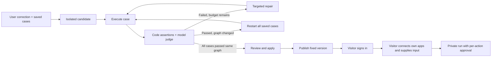

# Reviewed changes, regression testing, and runnable workflow links

This iteration lives on `codex/startup-foundation`. Execution still advances while the page is open; background jobs are intentionally deferred.

## The product flow

1. Build a workflow in chat and test its initial behavior.
2. In **Tests**, save representative inputs and expected results. Use exact JSON number or text fields, required phrases, or forbidden phrases. Each case supports multiple checks. Mark a case held-out to run it last with one attempt and no repair against its failure.
3. Describe a correction. It becomes a candidate rule, without changing the current workflow.
4. Run the candidate against the saved cases. Results, judge assessments, deterministic checks, reflections, and repairs appear in chat; the Tests panel summarizes the suite.
5. If a repair changes the graph, restart the complete suite on that candidate. A collection of passing results from different workflow versions cannot establish a passing release.
6. Apply the candidate only after every case passes the same version. Changes to the live workflow, rules, or saved cases invalidate promotion. Undo restores the prior workflow and rules as another version.
7. Press **Host** in the conversation header to create a fixed-version link. The dropdown provides copy, preview, a new link for the latest version, and disable controls. The description comes from the workflow explanation; there is no separate Share tab.

## What is enforced

| Boundary | Enforcement |
|---|---|
| Test expectations | Cases and checks are copied into the suite and each run before execution. Repairs receive them but cannot rewrite them. |
| Known failures | A failed code assertion overrides a positive model judgment. Model scores remain rubric judgments, not measured accuracy. |
| Candidate isolation | Validation does not append repairs to the live version history, curate task memory, or write owner tool knowledge. It withholds learned memory to reduce cross-case contamination. |
| Convergence | At most 5 cases, 10 checks per case, 3 suite rounds, 2 attempts per regression case (1 for held-out cases), and 8 tool calls per run. An unchanged repair stops immediately. |
| Token budget | The suite checks 120,000 cumulative tokens before advancing and between completed cases. A final in-flight model response can cross this threshold; it is not an exact prepaid-dollar cap. |
| External writes during tests | Validation blocks mutations before dispatch; the dispatch helper also refuses them. Reads can access the user's connected accounts. |
| Apply | Requires a passed suite and matching original workflow digest, rules, and saved cases. |
| Approval | Shows app, step, arguments, and exact request. Approve and decline bind to the pending action ID. Unknown outcomes require reconciliation instead of replay. |
| Publication | Stores an explicit projection of workflow instructions, rules, description, and version digest. No conversation, files, runs, memory, tests, or connector session is copied. Host explicitly publishes the current instructions and rules; authors should keep confidential data in run inputs, not reusable instructions. |
| Visitor isolation | Sign-in is required to create or run a private session. Storage and Composio sessions use the visitor's identity. Public metadata exposes only graph structure (names, roles, IDs, dependencies, and toolkits), never instructions, owner ID, or private history. |
| Shared version | Visitor sessions cannot edit or republish the source. One manual run per session, 8 tool calls, and a 40,000-token pre-step ceiling. |
| Spending | Each link atomically reserves at most 10 sessions. Model usage is paid by the installation's configured model account, not by the visitor's connected app account. |
| Revocation | Blocks new sessions and subsequent run/advance/resume/approve requests. It cannot undo an external action already in flight. Existing private evidence remains available to its owner. |

Exact decimal checks accept decimal strings for large monetary values; ordinary JSON numbers are interpreted by the JavaScript JSON parser. Checks do not constitute an invoice accounting engine. Monetary computation and source-row reconciliation still need a dedicated deterministic runtime before financial production use.

## Visitor experience

`/w/<publication-id>` shows the title and description above app connections and run inputs on the left, and the agent diagram on the right. The visitor signs in if needed, connects required apps, and supplies text or supported documents. Run workflow automatically creates an isolated execution behind the scenes; there is no session setup screen. Progress, proposed writes, and final output stay on that page. OAuth returns to the same workflow/session. Anonymous callers cannot spend model credits through the start endpoint.

The link can be viewed without signing in at the application layer. The deployment's ingress must also permit public access to `/w/*` and public workflow metadata; an installation-wide IAP wall would still require sign-in at the edge. A local URL is not internet hosting. No cloud service was created or restored in this iteration.

## Evaluation findings

The live fixture is a synthetic, document-only invoice calculator with two cases: a discounted order with an address, and an order missing its billing address. No external business actions were executed.

The first live suite was rejected. Arithmetic checks correctly passed the initial result, but the model judge falsely treated an existing address as missing. Its repair worsened the arithmetic; the frozen numeric checks caught that failure.

A second suite passed its original checks but changed the normal status from `draft` to `active`. Those tests did not yet assert the normal status, so the result demonstrated incomplete test coverage, not full correctness. That release was rolled back. Exact JSON text checks were added for both `draft` and `held`, and the evaluator now receives deterministic check results. Reflection and repair receive the original input and saved expectations.

The strengthened suite passed both cases on one final candidate after restarting the suite following a repair. Its three case runs consumed 26,785 tokens and $0.0960325 according to provider usage. This is small, development-set evidence; no held-out accuracy, causal learning benefit, or general finance reliability is claimed. The failed and intermediate runs remain in the demo chat and evidence file.

## Remaining work

Public deployment still needs an explicit host and supported identity configuration. Team permissions, installation-wide quotas, durable workers, independent held-out evaluation, complete connector delivery verification, and production storage/operations are not implemented by this feature. Published sessions deliberately use the existing manual-run behavior: completion means execution finished, not that an independent evaluator certified the result.

## Subsequent visitor check and reserved-case safeguard

A new visitor input exposed an additional failure after the earlier two-case suite passed: the workflow subtracted the order-wide discount once per unit and returned the wrong total under different field names. That published link was revoked and the release rolled back. This is a concrete limit of the earlier passing suite, not a successful unseen-input evaluation.

The implementation now supports a reserved (held-out) case: it runs last, receives only one attempt, and a failure rejects the candidate without an automatic repair using that case. Repair instructions now prohibit fixture-specific runtime dependencies and discourage adding agents when a targeted instruction change is sufficient. The shared page explicitly distinguishes execution completion from independent verification and restores the saved run input after reload.

With an explicit correction that the line discount applies once per order, the two regression cases and the reserved third case passed the same unchanged one-step workflow on their first attempts: 9,874 tokens and $0.0343675. The third case came from an observed failure; it validates the reserved-case execution mechanism but is not an independently collected benchmark holdout. There is still no claim of general invoice reliability. All earlier failures and superseded results remain in the evidence record.

The final shared-page smoke check used another input (2 units at 125, one discount of 25, and 10% tax). It returned subtotal 225, tax 22.50, total 247.50, and draft status. These four values were checked directly after the browser run. It used 528 tokens. This is an additional single-case smoke check, not a general accuracy estimate. The feature passes 103 automated tests, TypeScript checking, lint, and the build.

## Conversation and hosting UI verification

The corrected home screen opens directly to the composer, with existing conversations accessible through Recent workflows. Browser checks verified opening an existing chat, the Host dropdown, creating a link for the current version, and the copy confirmation. The shared page renders the graph alongside connections and inputs and no longer asks users to open a session. A direct Run click on the existing document-only fixture returned subtotal 210, tax 21, total 231, and draft status for 3 × 80 minus a single discount of 30, with 10% tax. Run again returned to the empty input form. This is a UI smoke check, not a new accuracy benchmark.
